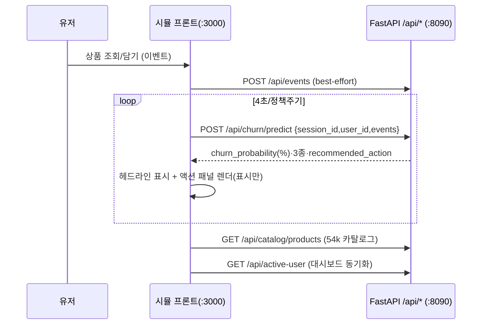

# 19-10. 최종 I/O 계약 — 서버 ↔ 시뮬레이션 사이트

작성일: 2026-06-23 · 기준: GAJIMA 실제 구현(`SKN32-2nd_GAJIMA_Dev`)
연계: 19-6(실시간 시뮬 점검), 26-15~26-19(시뮬 연동·카탈로그·정책), BUG-009

---

## 0. 공통 규약

- 방향: **시뮬 프론트(React, `client/src/lib/fastApiClient.ts`) → 서버 `/api/*`**.
- **raw JSON 계약**(대시보드 봉투와 별개) · **api-key 불필요**(옵션 `X-Sync-Key`=`SIM_SYNC_KEY` 설정 시만).
- `churn_probability`는 **퍼센트(0~100)**. CORS `*`. Base `http://127.0.0.1:8090`(또는 Cloudflare 터널 URL).
- 코드: `interfaces/http/sim_external_router.py`(`/api/*`), 추가 시뮬 상태는 `/sim/*`(19-9 §6, 대시보드 공유).

---

## 1. 실시간 이탈 예측 (핵심)

`POST /api/churn/predict`
```jsonc
// 요청 (ChurnPredictIn)
{ "session_id": "s1", "user_id": "U1",
  "events": [ { "event_type": "view|cart|remove_from_cart|purchase",
                "product_id": "...", "category_id": "...", "brand": "...",
                "price": 5.2, "quantity": 1, "timestamp": "ISO8601" } ] }
```
```jsonc
// 응답 (raw)
{ "session_id": "s1",
  "churn_probability": 45.3,            // % — 서버가 정책(max/ensemble/bounce_scaled/select) 적용한 단일 헤드라인
  "risk_level": "low|medium|high",
  "source": "hazard|model|data",
  "churn_policy": "max",
  "churn_breakdown": [                  // 3종 지표(%)
    {"key":"churn_7d","label":"7일 이탈(집계모델)","probability":11.0},
    {"key":"hazard","label":"실시간 하자드","probability":2.3},
    {"key":"bounce","label":"이탈 Bounce(30분)","probability":45.3} ],
  "recommended_action": {               // 이탈방지 액션(아래 §2)
    "action_type":"sns_view|discount_related|discount|none", "trigger":"...",
    "message":"...", "payload":{ ... } },
  "timestamp": "ISO8601(KST)" }
```
> 헤드라인은 **서버 단일 계산값**(BUG-009). 시뮬은 받은 값을 **표시만** 한다(클라에서 max 등 재계산 금지).

## 2. recommended_action payload 계약

| action_type | 조건(서버) | payload |
| --- | --- | --- |
| `discount_related` | 장바구니+미구매+idle≥5s | `{discount_pct, coupon_grade(긴급/경고/주의/관심), coupon_target, recommendation}` |
| `sns_view` | 첫 접속 또는 idle≥30s | `{sns_url, as_view_event:true, recommendation}` |
| `discount` | 조회 3+·미담음·idle≥5s | `{discount_pct, recommendation}` |
| `none` | 그 외 | `{}` |

`recommendation = {category_id, category_name, items:[{product_id,name,brand,price}×4]}`.
쿠폰 등급: ≥80%→20%(긴급)·65–80%→15%(경고)·50–65%→10%(주의)·else 5%(관심). 기준=헤드라인 churn_rate.

## 3. 추천 · 이벤트 · 분석

| 메서드·경로 | 요청 | 응답(raw) |
| --- | --- | --- |
| `POST /api/recommendations` | `{session_id,user_id,current_product_id,category_id,brand}` | `{recommendations:[{product_id,name,category_id,brand,price,score,reason}], …}` |
| `POST /api/events` | `EventIn`(event_id·user_id·session_id·event_type·event_time·product_id·category_id·brand·price·page_url·device_type…) | `{status:"ok", event_id, timestamp}` |
| `GET /api/analytics/session/{session_id}` | — | `{total_events, event_breakdown, products_viewed, products_in_cart, purchases, …}` |

## 4. 카탈로그 (REES46 seed 54k)

| 메서드·경로 | 응답 |
| --- | --- |
| `GET /api/catalog/products?limit=&category=&brand=&q=` | `{total:54571, count, products:[{product_id,category_id,category_name,brand,price,n_events,name}]}` |
| `GET /api/catalog/product/{product_id}` | 단건(없으면 **404**) |
| `GET /api/catalog/facets` | `{categories:[{category_id,name}], brands:[...]}` |

> 상품명·카테고리명은 결측이라 매핑 라벨(화장품 품목+브랜드, 26-19). `n_events` 인기순.

## 5. 대시보드 동기화

| 메서드·경로 | 용도 |
| --- | --- |
| `GET /api/active-user` | `{user_id, refresh_interval_sec}` — 대시보드가 설정한 진단 대상·갱신주기를 시뮬이 받아 같은 유저로 채점·표시 |

## 6. 확정 사항
- `/api/*`는 **raw·무인증**(혼합콘텐츠/봉투 없이 프론트 직결). 헤드라인은 서버 정책 단일소스.
- 이벤트 영속은 best-effort(미연결 시 스킵, 가짜값 금지). 미연결 시 프론트는 명시적 에러.
- 배포: Vercel 시뮬 ↔ 로컬 백엔드는 **Cloudflare 터널**(`VITE_FASTAPI_URL`)로 연결(26-18).

## 7. 시각화 (Mermaid)

