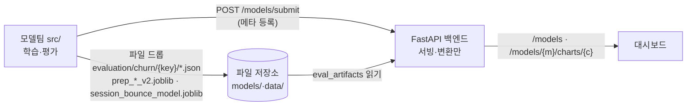

# 19-8. 최종 I/O 계약 — 서버 ↔ 모델팀

작성일: 2026-06-23 · 기준: GAJIMA 실제 구현(`SKN32-2nd_GAJIMA_Dev`)
연계: 19-3(모델 산출물 계약 초안), 19-3-1(추천 IO), BUG-008(artifact 스키마 호환)

---

## 0. 원칙

- **서버는 학습/재계산하지 않는다 — 서빙·변환만 한다**(artifact-first).
- 모델팀은 **① 파일(아티팩트) 드롭** + **② 등록 API(POST /models/submit)** 두 채널로 산출물을 인계한다.
- 서버는 파일을 읽어 chart-ready JSON / 추론으로 변환한다. 스키마가 바뀌어도 견고하게 읽는다(`.get()` + 분기, BUG-008).

방향: **모델팀(src/) → 산출물 → 서버**. 코드 위치: `backend/app/infrastructure/files/eval_artifacts.py`, `model_inference/python_model_loader.py`.

---

## 1. 채널 A — 파일 드롭 계약 (artifact-first)

### 1.1 churn 평가 아티팩트
경로: `data/processed/evaluation/churn/{model_key}/`
model_key ∈ `catboost · lightgbm · xgboost · randomforest · decisiontree · logreg · transformer`

| 파일 | 용도 | 키(필수) |
| --- | --- | --- |
| `metrics_summary.json` | 요약·베이스라인·드롭다운 | `roc_auc·pr_auc·f1·best_threshold`(또는 list `[{model,roc_auc,…}]`) |
| `roc_curve.json` | ROC | `fpr[], tpr[]` |
| `pr_curve.json` | PR | `recall[], precision[]` |
| `threshold_curve.json` | 임계 P/R/F1 | `threshold[]`(또는 `thresholds[]`)·`precision[]·recall[]`(f1 없으면 자동계산) |
| `calibration_curve.json` | 보정 | `prob_pred[]·prob_true[]`(또는 `mean_predicted_value[]·fraction_of_positives[]`) |
| `confusion_matrix.json` | 혼동행렬 | `tn·fp·fn·tp` |
| `lift_curve.json` | 리프트 | dict(`top_percent[]·capture_rate[]·lift[]`) **또는** list(`[{percentage_of_population,cumulative_response_rate,lift}]`) |
| `score_distribution.json` | 점수분포 | `bins[]·churn_count[]·non_churn_count[]`(또는 `counts[]`) |
| `shap_summary.json` | 피처중요도 | `feature[]·mean_abs_shap[]`(별칭 `feature_names·mean_abs_shap_values`) |
| `value_at_risk.json` | VaR treemap | `[{segment,value_at_risk}]` |
| `business_value.json` | 회복매출 | `top_percent[]·value_at_risk[]·expected_recovery[]` **또는** `{confusion_matrix, assumptions, estimated_total_value_KRW}` |
| `training_history.json` | 학습곡선 | `epoch[]·train_loss[]·val_loss[]` |
| `eval_predictions.parquet` | 유저별 점수 | `user_id·model_name·y_score·top_category·top_brand` |

> ⚠ 서버는 **구·신 스키마 모두 지원**(BUG-008). 키 직접 인덱싱 금지 — 모델팀이 키명을 바꿔도 위 별칭 범위면 동작.

### 1.2 실시간 서빙 번들 (필수)
| 파일 | 계약 | 서버 사용 |
| --- | --- | --- |
| `models/preprocessors/prep_{Name}_v2.joblib` | `{prep, model, calibrator, feature_order(=v2 22피처), threshold}` | `calibrator.predict_proba(원본 22피처)[:,1]` = churn 확률 |
| `models/sequence/session_bounce_model.joblib` | `{pipeline, feat[8], gap_sec:1800}` | 세션 바운스(30분) 확률 |
| `data/processed/evaluation/{session_bounce,next_category}/ensemble_summary.json` | `{n_models, members[], per_model{auc,…}}` | 보조 앙상블 현황 |

v2 22피처 순서(고정): `recency_days·tenure_days·ndays·n_events·n_view·n_cart·n_remove_from_cart·n_purchase·avg_price·purch_amt·min_price·max_price·std_price·purchase_avg_price·remove_ratio·cart_purchase_ratio·n_categories·cat_entropy·n_brands·brand_loyalty·n_sessions·events_per_session`.

## 2. 채널 B — 등록 API

`POST /models/submit` (X-API-Key, 봉투 응답) — 메타데이터 레지스트리 등록.

```jsonc
// 요청 (ModelSubmitIn)
{ "model_name": "LightGBM_Churn_v2", "model_type": "tree|linear|sequence|ensemble",
  "feature_schema_version": "v2", "label_name": "churn", "horizon_days": 7,
  "preprocessing_config": { "scale": "...", "feature_order": ["..."] },
  "artifact_path": "models/...", "dataset_path": "...",
  "metrics": { "roc_auc": 0.80, "pr_auc": 0.94, "best_threshold": 0.53, "best_f1": 0.91 },
  "is_active": true }
```

## 3. 서버가 모델 산출물을 노출하는 경로(읽기)

| 메서드·경로 | 반환 |
| --- | --- |
| `GET /models` · `GET /models/active` | 레지스트리·활성 모델 |
| `GET /models/{model_id}/evaluation` | 평가 메트릭 |
| `GET /models/{model}/charts/{chart}` | 아티팩트 → chart JSON(`pr-auc·roc-auc·threshold·calibration·confusion-matrix·lift·score-distribution·shap-summary·value-at-risk·revenue-recovery·train-val-loss`) |
| `GET /dashboard/models` | 산출물 보유 모델 7종(드롭다운) |

## 4. 확정 사항
- 서버는 **변환만**. 모델팀 산출물의 스키마 변경에 견고(별칭/분기).
- model_key는 **모델명 짧은 형**(CatBoost…) 또는 등록명(CatBoost_Churn_v2)·키(catboost) 모두 허용(`resolve_key`).
- 부재 산출물은 **빈 차트**(에러 아님, 19-4 빈상태 규칙).

## 5. 시각화 (Mermaid)

