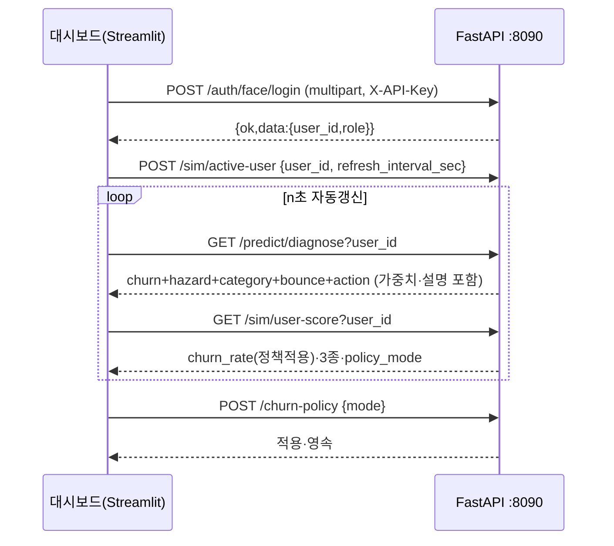

# 19-9. 최종 I/O 계약 — 서버 ↔ 대시보드

작성일: 2026-06-23 · 기준: GAJIMA 실제 구현(`SKN32-2nd_GAJIMA_Dev`)
연계: 19-4(대시보드 API 계약 초안), 19-7-1(IO 계약요소), BUG-007/009

---

## 0. 공통 규약

- 방향: **대시보드(Streamlit) → 서버(FastAPI) REST**. 대시보드는 DB/파일 직접 접근 금지.
- Base URL: `http://127.0.0.1:8090` · 인증: **헤더 `X-API-Key`**(필수).
- 응답: **봉투** `{"ok":bool, "data":any, "meta":{"schema_version":"dashboard.v1","source":str}, "error":{code,message}|null}`.
- 빈 데이터는 200 + `data:{}`/`[]`(에러 아님). 코드: `dashboard_streamlit/services/*` ↔ `interfaces/http/*`.

---

## 1. 인증 (얼굴 로그인)

| 메서드·경로 | 요청 | 응답 data |
| --- | --- | --- |
| `GET /auth/face/check-id?user_id=` | query | `{exists, ...}` |
| `POST /auth/face/register` | **multipart**: user_id·display_name·role·face_bbox·`image`(파일) | `{user_id, display_name, role}` |
| `POST /auth/face/login` | **multipart**: user_id·face_bbox·`image`(파일) | `{user_id, display_name, role, matched}` |
| `GET /auth/me` · `GET /auth/logins` | — | 세션·로그인 이력 |

## 2. 운영 요약 · 모델 · 차트

| 메서드·경로 | 응답 data(요지) |
| --- | --- |
| `GET /dashboard/summary` | `active_model·total_predictions·high_risk_count·avg_churn_probability·latest_prediction_at·expected_revenue_recovery·horizon_days` |
| `GET /dashboard/models` | 산출물 보유 모델 7종(드롭다운) |
| `GET /models` · `/models/active` · `/models/{id}/evaluation` | 레지스트리·활성·평가 |
| `GET /dashboard/charts/{slug}` | 모델무관: `system-architecture·cohort-retention·baseline-comparison·data-distribution` |
| `GET /models/{model}/charts/{slug}` | 모델별: `pr-auc·roc-auc·threshold·calibration·confusion-matrix·lift·score-distribution·shap-summary·value-at-risk·revenue-recovery·train-val-loss` |

차트 응답 공통: `{chart_name, chart_type, x, y, data:[…], meta}`.

## 3. 개인 진단 · 예측

| 메서드·경로 | 응답 data(요지) |
| --- | --- |
| `GET /predict/diagnose?user_id=&recency_days=` | `recency_days` + **churn**{models[],ensemble_prob,**weights,weight_note**,n_models} + **hazard**{prob,tau_days,k} + **category**{models[],weights,weight_note} + **bounce**{models[],weights,weight_note} + **action**{discount_pct,message,reason}\|null |
| `GET /predictions/top-risk` | 고위험 고객 `[{user_id,churn_probability,risk_level,…}]` |
| `GET /predictions/latest?user_id=` | 최신 예측(평탄 객체, 없으면 200 빈) |
| `POST /predict/realtime` | `{user_id,model}` → 실시간 재추론 |
| `GET /dashboard/user/{user_id}` | 유저 개인 대시보드 |

> diagnose 앙상블 가중치: churn=부스팅3 균등 · bounce=5종 AUC비례 · category=시퀀스(GRU·Transformer 0.40)+LightGBM 0.20. (`weight_note`로 설명 동반)

## 4. Churn Rate 정책 (단일 소스 — BUG-009)

| 메서드·경로 | 요청/응답 |
| --- | --- |
| `GET /churn-policy` | `{mode, select_key, bounce_floor, bounce_ceiling, weights}` |
| `POST /churn-policy` | body `{mode:max\|ensemble\|bounce_scaled\|select, …}` → 서버 적용·파일 영속 |

대시보드는 정책을 **설정(POST)** 하고, 헤드라인은 **서버가 계산한 값**(`/sim/user-score`의 `churn_rate`)을 그대로 표시(로컬 재계산 금지).

## 5. 추천 · 앙상블 · 쿠폰 · 리텐션

| 메서드·경로 | 응답 data |
| --- | --- |
| `GET /samples/users?n=` | 입력 예시용 실제 유저 ID 샘플 |
| `GET /recommendations/{user_id}` | `{top_categories[], recommendations[], source}` |
| `GET /session-bounce` · `GET /ensemble/aux-summary` | 세션바운스 메타 · 보조 앙상블(성능) |
| `POST /ensemble/run` | 앙상블 계산 |
| `GET /coupons/summary` · `GET /coupons/targets?grade=&limit=` | 쿠폰 등급별 인원 · 대상자 |
| `POST /retention-actions` | 리텐션 액션 로그 기록 |

## 6. 시뮬 상태 제어(대시보드 ↔ 시뮬 연결)

| 메서드·경로 | 용도 |
| --- | --- |
| `POST /sim/active-user` body `{user_id, refresh_interval_sec}` | 대시보드가 **진단 대상 유저·갱신주기** 설정 → 시뮬이 동일 유저로 동작 |
| `GET /sim/active-user` | 현재 대상 유저 |
| `GET /sim/user-score?user_id=` | 유저의 **실시간 세션 점수**(`churn_rate`(정책적용)·`churn_7d·churn_hazard·churn_bounce·policy_mode·bounce_window_min`) |
| `GET /sim/score?session_id=` | 세션 단건 점수 |

## 7. 확정 사항
- 모든 응답 **봉투** + `X-API-Key`. 빈 데이터=200(에러 아님).
- diagnose는 **3 태스크 앙상블 + 가중치 설명 + 액션**을 한 번에 제공.
- 헤드라인 Churn Rate는 **서버 단일 계산값**을 표시(대시보드 로컬 재계산 폐지, BUG-009).

## 8. 시각화 (Mermaid)

